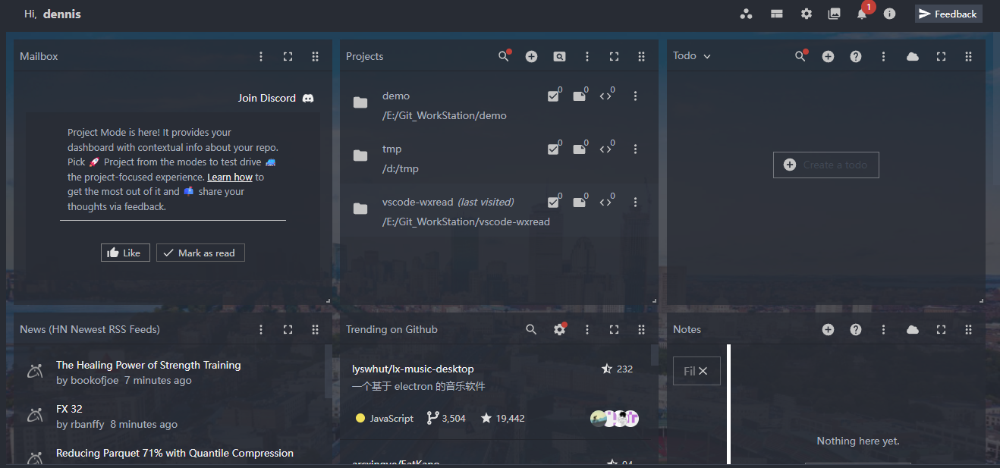

# 微信阅读 VSCode 插件

## 使用方法

- 通过命令打开：
  `CTRL+SHIFT+P` 再输入：`wxread`
- 通过状态栏打开：
  点击 ** 微信阅读**

## 待办

- [ ] 重构代码
- [ ] 支持自定义背景图
- [ ] 支持阅读窗口隐藏（初步想法是类似将页面的显示放到终端显示区）
- [ ] 参考 [vscode-marquee](https://github.com/stateful/vscode-marquee) 实现面板化

  

## 致谢

- [VS Code 插件开发文档](https://github.com/Liiked/VS-Code-Extension-Doc-ZH)
- [vscode-git-graph](https://github.com/mhutchie/vscode-git-graph)
- [http-proxy-middleware](https://github.com/chimurai/http-proxy-middleware)
- [koa2-nginx](https://github.com/my9074/koa2-nginx)
- [get-port](https://github.com/sindresorhus/get-port)
- [connect](https://github.com/senchalabs/connect)
- [vscode-marquee](https://github.com/stateful/vscode-marquee)
